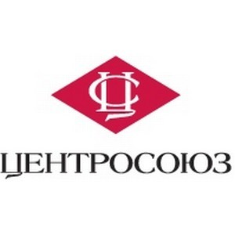

<!-- HELLO HEADER -->
<h3 align="center">Hello👋! My names is <font color="#039BE5">Michael</font>.</h3>

<!--  -->


<!-- CONTACT DETAILS -->
___

<table align="center" width="100%">
  <tr>
    <td width="33.3%">
        <strong>Date of birth:</strong> August 13, 1987 <br />
        <strong>Nationality:</strong> Russia <br />
        <strong>Marital status:</strong> Married <br />
    </td>
    <td width="33.3%">
        <a href="mailto:lpestlname@gmail.com"> lpestlname@gmail.com </a><br />
        <a href="tel:+7-931-531-66-25"> +7 (931) 531-66-25 </a><br />
        <a href="https://t.me/lPestl"> @lPestl </a><br />
    </td>
    <td width="33.3%">
        <a href="https://discordapp.com/users/408238165443477504/"> lpestl#3234 </a><br />
        <a href="https://www.linkedin.com/in/lpestl"> in/lpestl </a><br />
        <a href="https://vk.com/lpestl"> /lpestl </a><br />
    </td>
  </tr>
</table>

___


<!-- PERSONAL PROFILE STATEMENT (ABOUT) -->

## <font color="#039BE5">Personal Profile Statement</font>

&nbsp; &nbsp; &nbsp; &nbsp; I am a 
 I have been developing software since 2007. I actively use ***C/C++, C#, Python***. Participated in projects in *F#, Java, Kotlin, JavaScript*. Contributed to Open-Source projects such as [Unreal Engine 4/5](https://github.com/EpicGames/UnrealEngine), [OpenFrameworks](https://github.com/openframeworks/openFrameworks), [TortoiseGit](https://github.com/TortoiseGit/TortoiseGit), etc. For the last 7 years I have been developing in C++ in the context of Unreal Engine. For a long time, I interacted with other engines, such as Unity, Unigine, NeoAxis, etc.  
&nbsp; &nbsp; &nbsp; &nbsp; Self-starter and strong independent worker. Extensive experience in creating game mechanics with a focus on creating tools for designers. Strong team player. Have experience in managing small teams. Deep knowledge of backend and network client-server interactions. Familiar with the intricacies of version control systems.   
&nbsp; &nbsp; &nbsp; &nbsp; I am able to find a common language with customers, identify needs for the end user and implement convenient and reliable applications from the UX point of view. In this regard, a fairly wide technology stack has developed. The main motivator for me is the feedback from the end users.


<!-- TECH STACK -->

<details>
  <summary>
    <font size="4" color="#039BE5">🔧 Tech stack</font>
  </summary>
  <p>
    <hr>
    <table width="100%">
        <tr>
            <td width="50%">
                <em><strong>Programming languages:</strong></em><br />
                - , , , , , , etc.<br />
                <em><strong>Version control:</strong></em><br />
                - , , , .<br />
                <em><strong>IDEs:</strong></em><br />
                - , , , , , , , , , , , .<br />
                <em><strong>Databases:</strong></em><br />
                - , , , , , .<br />
            </td>
            <td width="50%">
                <em><strong>Framework, SDKs, libraries, tools:</strong></em><br />
                - , , , , , , , , , , , , , , , , , , , , , .<br />
                <em><strong>Engines:</strong></em><br />
                - , , , , , , .<br />
                <em><strong>Application packages:</strong></em><br />
                - , , , , , , , , , .
            </td>
        </tr>
    </table>
    <hr>
  <p>
</details>


<!-- EDUCATION -->

<details>
  <summary>
    <font size="4" color="#039BE5">🎓 Education</font>
  </summary>
  <p>
    <hr>
    <table width="100%">
        <tr>
            <td width="20%">
                 
            </td>
            <td width="80%">
                <a href="https://www.amursu.ru/">The Amur State University</a>, Blagoveshchensk <br />
                <a href="https://www.amursu.ru/obrazovanie/fakultety/fmi/">Department of Mathematics and Computer Science</a> <br />
                Master`s Degree in <em><strong>“Automated Information Processing and Control Systems”</strong></em>.<br />
            </td>
        </tr>
    </table>
    <hr>
  </p>
</details>


<!-- WORK EXPERIENCE -->

<details>
  <summary>
    <font size="4" color="#039BE5">👷 Work Experience</font>
  </summary>
  <p>
    <hr>
    <table width="100%">
        <!-- 
        --
        TEMPORAL GAMES 
        --
        -->
        <tr>
            <td width="25%">
                
            </td>
            <td width="75%">
                <table align="center" width="100%">
                    <tr>
                        <td>
                            <a href="https://temporal.games/"></a>
                        </td>
                        <td style="width:75%">                  
                            <h1><a href="https://temporal.games/">Temporal Games inc.</a></h1>
                        </td>
                    </tr>
                </table>
            </td>
        </tr>
        <tr>
            <td />
            <td>
                <h2>Senior UE5 Engineer (C++)</h2>
                <em><u>Responsibilities:</u></em><br />
                <li>Implementation of Virtual Beings components and subsystems in Unreal Engine 5 and integration with backend AI solutions using C++;</li>
                <li>adaptation of functionality to work in multiplayer based on the online meta-universe project;</li>
                <li>plugins architecture improvements.</li>
                <br />
                <em><u>Achievements:</u></em><br />
                <li>developed a universal plug-in "State Machine" with a flexible graphical graph editor in UE5 (based on the Behavior tree Editor);</li>
                <li>various state machines for the behavior of virtual characters have been developed and implemented in the project, such as the Dialogue State Machine, the State Behavior Machine, the Emotional State Machine;</li>
                <li>implemented the logic of creating and managing voice chat rooms for virtual characters (AI) and regular users;</li>
                <li>linking and setting up all of the above modules with the visual component of virtual characters, namely lipsync, visemes for literals, gestures, facial emotions, etc.</li>
            </td>
        </tr>
        <!-- 
        --
        VK / MY GAMES 
        --
        -->
        <tr>
            <td width="25%">
                
            </td>
            <td width="75%">
                <table align="center" width="100%">
                    <tr>
                        <td>
                            <a href="https://team.vk.company/"></a>
                            <a href="https://my.games/"></a>
                        </td>
                        <td style="width:75%">                  
                            <h3><a href="https://team.vk.company/">VK</a></h3>
                            <h1><a href="https://my.games/">My.Games Inc.</a></h1>
                        </td>
                    </tr>
                </table>
            </td>
        </tr>
        <tr>
            <td />
            <td>
                <h2>Senior Unreal Engine Developer (UE4/5 C++)</h2>
                <em><u>Responsibilities:</u></em><br />
                <li>direct interaction with the Art Department and Game Designers to collect requests for the development of new tools and new game mechanics;</li>
                <li>formation of technical specifications upon request and planning;</li>
                <li>development and integration of new tools for designers.</li>
                <br />
                <em><u>Achievements:</u></em><br />
                <li>developed a standalone plugin for UE4/5 (independent of the main game code) QuestSystem, for creating and editing game quests consisting of quest stages. The quest editor is presented as a graph editor inside UE4/5 (based on the Behavior tree Editor);</li>
                <li>various state machines for the behavior of virtual characters have been developed and implemented in the project, such as the Dialogue State Machine, the State Behavior Machine, the Emotional State Machine;</li>
                <li>developed the Unreal Editor extension for managing NPC Camps (these are certain points on the map with dynamic NPC spawn and rewards for overcoming them);</li>
                <li>developed the Unreal Editor extension to create and configure universal PuzzleLikeActivities in the game.</li>
            </td>
        </tr>
        <!-- 
        --
        LESTA / WARGAMING 
        --
        -->
        <tr>
            <td width="25%">
                
            </td>
            <td width="75%">
                <table align="center" width="100%">
                    <tr>
                        <td>
                            <a href="https://lesta.ru/"></a>
                            <a href="https://wargaming.com/"></a>
                        </td>
                        <td style="width:75%">                  
                            <h3><a href="https://lesta.ru/">Lesta Studio</a></h3>
                            <h1><a href="https://wargaming.com/">Wargaming Saint Peterburg</a></h1>
                        </td>
                    </tr>
                </table>
            </td>
        </tr>
        <tr>
            <td />
            <td>
                <h2>Generalist programmer/Tech & Tools department</h2>
                <em><u>Achievements:</u></em><br />
                <li>developed of a server API for automating game playtests (Python, flask, docker-compose, elasticsearch, logstash, kibana);</li>
                <li>developed of a client application for automating playtests (WPF, monotorrent, API integration for interacting with Jenkins, Team City);</li>
                <li>developed of utilities for setting control points for cameras in Unreal Engine 4 (UE4, Bluetilities widgets);</li>
                <li>developed of module GitSourceControl with visualization of different branches, the ability to switch between branches in the editor, the ability to use LFS features to lock / unlock binary files (UE4 / C++);</li>
                <li>developed of a utility for exporting data assets to json format and dynamically generating new data assets from json (import) (UE4 / C++);</li>
                <li>participation in the implementation of the gameplay functionality of the new AAA game in the sci-fi setting (UE4 / C++).</li>
            </td>
        </tr>
        <!-- 
        --
        FREELANCE 2019 
        --
        -->
        <tr>
            <td width="25%">
                
            </td>
            <td width="75%">
                <h1><a href="https://freelance.habr.com/freelancers/lpestl/">Freelance</a></h1>
            </td>
        </tr>
        <tr>
            <td />
            <td>
                <h2>Software engineer</h2>
                <em><u>Achievements:</u></em><br />
                <li>development of interactive VR presentation for new generation trains Hyperloop (Unreal Engine 4, Blueprints);</li>
                <li>participation in the development of add-ons for OpenFrameworks (open source) (C/C ++);</li>
                <li>development of a WPF application for diagrams of the sequence of execution of scripts (.Net C# WPF).</li>
            </td>
        </tr>
        <!-- 
        --
        RUBIUS GROUP LLC 
        --
        -->
        <tr>
            <td width="25%">
                
            </td>
            <td width="75%">
                 <table align="center" width="100%">
                    <tr>
                        <td>
                            <a href="https://rubius.com/"></a>
                        </td>
                        <td style="width:75%">                  
                            <h1><a href="https://rubius.com/">Rubius Group LLC</a></h1>
                        </td>
                    </tr>
                </table>
            </td>
        </tr>
        <tr>
            <td />
            <td>
                <h2>Category 1 programmer (Lead software engineer)</h2>
                <em><u>Achievements:</u></em><br />
                <li>developed a desktop client for a client-server engineering application for civil construction work visualization;</li>
                <li>developed of SDK for integrating Unigine Engine 2.7 render core into the .NET applications (C#, C++);</li>
                <li>developed of an application (WPF, DevExpress, SQL Server, Paradox 7.x) for monitoring and vibration diagnostics for DRG electric motors;</li>
                <li>developed of an application to demonstrate the internal structure of various engines, visualized using CAD models (Unreal Engine / C++).</li>
            </td>
        </tr>
        <!-- 
        --
        OctoBox Interactive 
        --
        -->
        <tr>
            <td width="25%">
                
            </td>
            <td width="75%">
                 <table align="center" width="100%">
                    <tr>
                        <td>
                            <a href="https://octoboxint.com/"></a>
                        </td>
                        <td style="width:75%">                  
                            <h1><a href="https://octoboxint.com/">OctoBox Interactive</a></h1>
                        </td>
                    </tr>
                </table>
            </td>
        </tr>
        <tr>
            <td />
            <td>
                <h2>Unreal Engine Programmer</h2>
                <em><u>Achievements:</u></em><br />
                <li>developed the functional part of the game "Knights VR" for Oculus and Vive;</li>
                <li>developed mechanics for controlling a horse rider for VR;</li>
                <li>several QTE minigames were developed for equestrian tournaments of the Middle Ages.</li>
            </td>
        </tr>
        <!-- 
        --
        LANIT-TERCOM 
        --
        -->
        <tr>
            <td width="25%">
                
            </td>
            <td width="75%">
                 <table align="center" width="100%">
                    <tr>
                        <td>
                            <a href="https://lanit-tercom.ru/"></a>
                        </td>
                        <td>                  
                            <h1><a href="https://lanit-tercom.ru/">LANIT-TERCOM</a></h1>
                        </td>
                    </tr>
                </table>
            </td>
        </tr>
        <tr>
            <td />
            <td>
                <h2>Lead software engineer</h2>
                <em><u>Responsibilities:</u></em><br />
                <li>liaison with overseas customers;</li>
                <li>coordination of software requirements specifications;</li>
                <li>leading the design and development process;</li>
                <li>providing support for the end product.</li><br />
                <em><u>Achievements:</u></em><br />
                <li>developed the mobile game “VR Adventures of Pirate Cat” and published it on Google Play (Unity3D 4-5, Facebook SDK);</li>
                <li>developed an application called Tennis Manager for the Samsung Gear S2 smart watch (TizenSDK, JS, Angular);</li>
                <li>developed a full-fledged Facebook plug-in for Unreal Engine 4 for Windows (UE4/C++);</li>
                <li>developed various applications for VR HTC Vive using Unreal Engine 4.</li>
            </td>
        </tr>
        <!-- 
        --
        HitekLab Light Technologies LLC
        --
        -->
        <tr>
            <td width="25%">
                
            </td>
            <td width="75%">
                 <table align="center" width="100%">
                    <tr>
                        <td>
                            <a href="http://hiteklab.ru/"></a>
                        </td>
                        <td>                  
                            <h1><a href="http://hiteklab.ru/">HitekLab Light Technologies LLC</a></h1>
                        </td>
                    </tr>
                </table>
            </td>
        </tr>
        <tr>
            <td />
            <td>
                <h2>C/C++ programmer</h2>
                <em><u>Responsibilities:</u></em><br />
                <li>developed and supported software for controlling an interactive floor projection system;</li>
                <li> provided support to users of the interactive systems;</li><br />
                <em><u>Achievements:</u></em><br />
                <li>developed an interactive augmented reality project for The Blagoveshchensk 2014 Day event;</li>
                <li>developed a computer vision controlled video surveillance system to expand the capabilities of interactive floor projection software based on OpenCV C/C++ libraries;</li>
                <li>developed visual effects for the interactive floor projection system in C/C++ based on openFrameworks and using OpenGL;</li>
                <li>developed software in C/C++ for controlling an interactive showcase system;</li>
                <li>developed software in C/C++ for controlling an interactive kid’s playdesk system.</li>
            </td>
        </tr>
        <!-- 
        --
        Thematica
        --
        -->
        <tr>
            <td width="25%">
                
            </td>
            <td width="75%">
                 <table align="center" width="100%">
                    <tr>
                        <td>
                            <a href="http://thematica.info/"></a>
                        </td>
                        <td>                  
                            <h1><a href="http://thematica.info/">Thematica</a></h1>
                        </td>
                    </tr>
                </table>
            </td>
        </tr>
        <tr>
            <td />
            <td>
                <h2>Game developer</h2>
                <u>Achievements:</u></em><br />
                <li>developed the game "Guess the Dress!" for iOs in X-Code using Objective-C;</li>
                <li>adapted the game "Guess the Dress!" for Android in Unity3d using C#;</li>
                <li>developed the game "Cars in Sandbox" for iOs in X-Code using Objective-C;</li>
                <li>adapted the game "Cars in Sandbox" for Android in Unity3d using C #;</li>
                <li>developed 3 other games (not released) for Android in Unity3d.</li>
            </td>
        </tr>
    </table>
    <hr>
    <p>
    <br />
    <details>
        <summary>
            <font size="4" color="#039BE5">Experience in related fields</font>
        </summary>
        <p>
        <table width="100%">
            <!-- 
            --
            FREELANCE
            --
            -->
            <tr>
                <td width="25%">
                    <br />
                    
                </td>
                <td width="75%">
                    <h1><a href="https://freelance.habr.com/freelancers/lpestl/">Freelance</a></h1>
                </td>
            </tr>
            <tr>
                <td />
                <td>
                    <h2>Software engineer</h2>
                    <em><u>Achievements:</u></em><br />
                    <li>developed the software and related documentation for a master's thesis titled “Designing a Fuzzy Logic-Based Medical Diagnostics Information System”;</li>
                    <li>developed a centralized automated system for processing court applications and SMS notices for the Amur Region Lawyer Bar Association;</li>
                    <li>participated in the development of a mobile app that incorporated a 2D game: developed the UI for game scenes in CocosSharp; developed a module for connecting to device sensors via Bluetooth Low Energy;</li>
                    <li>developed an app core in F# linked to Xamarin.Forms;</li>
                    <li>developed an automated information system (AIS) called “A Multi-Platform Catalogue of Low Poly Models”. It was made in Unity3d in C#, and an SQLite database was built. 3dsMax was used in the development process;</li>
                    <li>developed a software program called “Visualization of 3D Models in Computer Graphics”. It was made in Microsoft Visual Studio in C++ using Win32App, DirectX 9;</li>
                    <li>developed a game titled “Endless maze” for the Android mobile platform. It was made in Unity3d in C#;</li>
                    <li>developed a software program called “Program for Computing a Theoretical Micrograph of the Raster Image of the Domain Structure of Ferroelectrics”. It was made in Microsoft Visual Studio in C++ using WinForms, CLR, .NET framework and the OpenCV computer vision library;</li>
                    <li>developed a software program and a database called “Short-Term Forecasting of Currency Exchange Rates”. It was made in Embarcadero RAD Studio in C++ using ADO technologies. The DB was made in Microsoft Access;</li>
                    <li>developed a software program called “Automated Optimization of Production Processes Using Linear Programming Tasks”. It was made in Embarcadero RAD Studio in C++;</li>
                    <li>developed a software program called “Visualization of Geometric Deterministic Fractals”. It was made in Microsoft Visual Studio in C++ using MFC technologies;</li>
                    <li> developed visual effects for an “interactive floor” system. It was made in Microsoft Visual Studio in C++ using the openFrameworks, SDL and OpenGL libraries;</li>
                    <li>developed a software program for an Augmented Reality management system. It was made in Microsoft Visual Studio in C++ using openFrameworks, ARtoolKitPlus, Vuforia libraries;</li>
                    <li>developed a software program called "Visualization of Throwing a Sphere in a Vacuum”. It was made in Embarcadero RAD Studio in C++ using OpenGL v1;</li>
                    <li>developed a client / server chat software. It was made in Embarcadero RAD Studio in C++ using TCP/IP technologies;</li>
                    <li>plus lots of other sundry projects.</li>
                </td>
            </tr>
            <hr>    
            <!-- 
            --
            AldanzolotoBank 
            --
            -->
            <tr>
                <td width="25%">
                    
                </td>
                <td width="75%">
                    <table align="center" width="100%">
                        <tr>
                            <td>
                                <a href="https://www.azbank.ru/"></a>
                            </td>
                            <td style="width:75%">                  
                                <h1><a href="https://www.azbank.ru/">AldanzolotoBank</a></h1>
                            </td>
                        </tr>
                    </table>
                </td>
            </tr>
            <tr>
                <td />
                <td>
                    <h2>Head of Information Security and New Technologies</h2>
                    <em><u>Responsibilities:</u></em><br />
                    <li>information security assurance in a banking institution in compliance with Bank of Russia standard STO BR IBBS-1.0-2014.</li>
                    <br />
                    <em><u>Achievements:</u></em><br />
                    <li>a self-assessment of the lending institution was conducted in accordance with STO BR IBBS-1.0-2014;</li>
                    <li>the lending institution obtained a license as required by RF Government Resolution No. 313 of April 16, 2012, and guidance on the licensed activity;</li>
                    <li>automatic exchange of information with the Federal Tax Service was set up and “Corporate Taxpayer” software was deployed;</li>
                    <li>internal bank documents (bylaws, guidelines, logs, etc.) were prepared and implemented.</li>
                </td>
            </tr>
            <!-- 
            --
            Yakutia Railways OJSC 
            --
            -->
            <tr>
                <td width="25%">
                    
                </td>
                <td width="75%">
                    <table align="center" width="100%">
                        <tr>
                            <td>
                                <a href="https://rw-y.ru/"></a>
                            </td>
                            <td style="width:75%">                  
                                <h1><a href="https://rw-y.ru/">Yakutia Railways OJSC</a></h1>
                            </td>
                        </tr>
                    </table>
                </td>
            </tr>
            <tr>
                <td />
                <td>
                    <h2>Data processing center engineer</h2>
                    <em><u>Responsibilities:</u></em><br />
                    <li>provided support for and further developed an existing Production Enterprise Management configuration  in 1C.</li>
                    <br />
                    <em><u>Achievements:</u></em><br />
                    <li>developed software for automating enterprise network management and administration processes in Microsoft Visual Studio in C++ using WinForm, CLR, .Net Framework 4 technologies;</li>
                    <li>rolled out and followed up the developed software;</li>
                    <li>developed a module for processing XML messages in a Production Enterprise Management configuration;</li>
                    <li>LAN installation;</li>
                    <li>provided technical support for other employees.</li>
                </td>
            </tr>
            <!-- 
            --
            The Amur Consumer Cooperative Union
            --
            -->
            <tr>
                <td width="25%">
                    
                </td>
                <td width="75%">
                    <table align="center" width="100%">
                        <tr>
                            <td>
                                <a href="http://amur-28.ru/"></a>
                            </td>
                            <td style="width:75%">                  
                                <h1><a href="http://amur-28.ru/">The Amur Consumer Cooperative Union</a></h1>
                            </td>
                        </tr>
                    </table>
                </td>
            </tr>
            <tr>
                <td />
                <td>
                    <h2>System administrator</h2>
                    <em><u>Responsibilities:</u></em><br />
                    <li>made field trips to various locations in the region to ensure full automation of retail outlets;</li>
                    <li>installed and commissioned cashier equipment;</li>
                    <li>LAN installation;</li>
                    <li>set up, supported and hooked up local outlet databases to a distributed regional database based on a configuration in “1C: Rarus”.</li>
                    <br />
                    <em><u>Achievements:</u></em><br />
                    <li>set up, supported and hooked up the regional database to a distributed RF database based on a configuration in “1C: Rarus”;</li>
                    <li>set up two district databases (in Tambovsky and Zavitinsky districts), supported and hooked up the databases to a distributed regional database based on a configuration in “1C: Rarus”;</li>
                    <li>installed and set up cashier equipment, provided follow up support for 6 retail outlets.</li>
                </td>
            </tr>
            <!-- 
            --
            The Octyabrsky Revolution Shipyard 
            --
            -->
            <tr>
                <td width="25%">
                    
                </td>
                <td width="75%">
                    <table align="center" width="100%">
                        <tr>
                            <td>
                                <a href="https://amurnelma.ru/"></a>
                            </td>
                            <td style="width:75%">                  
                                <h1><a href="https://amurnelma.ru/">The Octyabrsky Revolution Shipyard</a></h1>
                            </td>
                        </tr>
                    </table>
                </td>
            </tr>
            <tr>
                <td />
                <td>
                    <h2>Software engineer</h2>
                    <li>built, developed and implemented databases based on a new configuration in “1S: Enterprise”;</li>
                    <li>office equipment repair and maintenance;</li>
                    <li>LAN installation.</li>
                </td>
            </tr>
            <!-- 
            --
            Amur Construction Fair LLC 
            --
            -->
            <tr>
                <td width="25%">
                    
                </td>
                <td width="75%">
                    <table align="center" width="100%">
                        <tr>
                            <td>
                                <a href="https://asyastroy.ru/"></a>
                            </td>
                            <td style="width:75%">                  
                                <h1><a href="https://asyastroy.ru/">Amur Construction Fair LLC</a></h1>
                            </td>
                        </tr>
                    </table>
                </td>
            </tr>
            <tr>
                <td />
                <td>
                    <h2>System administrator</h2>
                    <li>database support and maintenance;</li>
                    <li>retail equipment maintenance and repair;</li>
                    <li>LAN installation.</li>
                </td>
            </tr>
        </table>
    </datails>
</details>

<br />
<br />


<!-- SOME INFOGRAPHICS -->


<!-- 

 -->


<!-- ASCII ART -->

<!-- 
```Diff
+           ██╗      ██████╗ ███████╗███████╗████████╗  ██╗      
+           ██║      ██╔══██╗██╔════╝██╔════╝╚══██╔══╝  ██║      
+           ██║      ██████╔╝█████╗  ███████╗   ██║     ██║      
+           ██║      ██╔═══╝ ██╔══╝  ╚════██║   ██║     ██║      
+           ██████╗  ██║     ███████╗███████║   ██║     ██████╗  
+           ╚═════╝  ╚═╝     ╚══════╝╚══════╝   ╚═╝     ╚═════╝  
```
 -->


<!-- LAST COMMIT BADGE -->

<p align="right">

