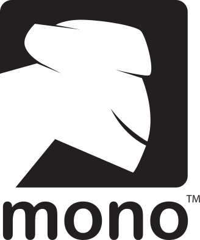

<!-- HELLO HEADER -->
<h3 align="center">Hello👋! My names is <font color="#039BE5">Michael</font>.</h3>


<!-- CONTACT DETAILS -->
___

<table width="100%">
  <tr>
    <td width="33.3%">
        <strong>Date of birth:</strong> August 13, 1987 <br />
        <strong>Nationality:</strong> Russia <br />
        <strong>Marital status:</strong> Married <br />
    </td>
    <td width="33.3%">
        <a href="mailto:lpestlname@gmail.com"> lpestlname@gmail.com </a><br />
        <a href="tel:+7-931-531-66-25"> +7 (931) 531-66-25 </a><br />
        <a href="https://t.me/lPestl"> @lPestl </a><br />
    </td>
    <td width="33.3%">
        <a href="https://discordapp.com/users/408238165443477504/"> lpestl#3234 </a><br />
        <a href="https://www.linkedin.com/in/lpestl"> in/lpestl </a><br />
        <a href="https://vk.com/lpestl"> /lpestl </a><br />
    </td>
  </tr>
</table>

___


<!-- PERSONAL PROFILE STATEMENT (ABOUT) -->

## <font color="#039BE5">Personal Profile Statement</font>

&nbsp; &nbsp; &nbsp; &nbsp; I am a 
 I have been developing software since 2007. I actively use ***C/C++, C#, Python***. Participated in projects in *F#, Java, Kotlin, JavaScript*. Contributed to Open-Source projects such as [Unreal Engine 4/5](https://github.com/EpicGames/UnrealEngine), [OpenFrameworks](https://github.com/openframeworks/openFrameworks), [TortoiseGit](https://github.com/TortoiseGit/TortoiseGit), etc. For the last 7 years I have been developing in C++ in the context of Unreal Engine. For a long time, I interacted with other engines, such as Unity, Unigine, NeoAxis, etc.  
&nbsp; &nbsp; &nbsp; &nbsp; Self-starter and strong independent worker. Extensive experience in creating game mechanics with a focus on creating tools for designers. Strong team player. Have experience in managing small teams. Deep knowledge of backend and network client-server interactions. Familiar with the intricacies of version control systems.   
&nbsp; &nbsp; &nbsp; &nbsp; I am able to find a common language with customers, identify needs for the end user and implement convenient and reliable applications from the UX point of view. In this regard, a fairly wide technology stack has developed. The main motivator for me is the feedback from the end users.


<!-- TECH STACK -->

<details>
  <summary>
    <font size="4" color="#039BE5">🔧 Tech stack</font>
  </summary>
  <p>
    <hr>
    <table width="100%">
        <tr>
            <td width="50%">
                <em><strong>Programming languages:</strong></em><br />
                - , , , , , , etc.<br />
                <em><strong>Version control:</strong></em><br />
                - , , , .<br />
                <em><strong>IDEs:</strong></em><br />
                - , , , , , , , , , , , .<br />
                <em><strong>Databases:</strong></em><br />
                - , , , , , .<br />
            </td>
            <td width="50%">
                <em><strong>Framework, SDKs, libraries, tools:</strong></em><br />
                - , , , , , , , , , , , , , , , , , , , , , .<br />
                <em><strong>Engines:</strong></em><br />
                - , , , , , , .<br />
                <em><strong>Application packages:</strong></em><br />
                - , , , , , , , , , .
            </td>
        </tr>
    </table>
    <hr>
  <p>
</details>


<!-- EDUCATION -->

<details>
  <summary>
    <font size="4" color="#039BE5">🎓 Education</font>
  </summary>
  <p>
    <hr>
    <table width="100%">
        <tr>
            <td width="20%">
                 
            </td>
            <td width="80%">
                <a href="https://www.amursu.ru/">The Amur State University</a>, Blagoveshchensk <br />
                <a href="https://www.amursu.ru/obrazovanie/fakultety/fmi/">Department of Mathematics and Computer Science</a> <br />
                Master`s Degree in <em><strong>“Automated Information Processing and Control Systems”</strong></em>.<br />
            </td>
        </tr>
    </table>
    <hr>
  </p>
</details>


<!-- WORK EXPERIENCE -->

<details>
  <summary>
    <font size="4" color="#039BE5">👷 Work Experience</font>
  </summary>
  <p>
    <hr>
    <table width="100%">
        <tr>
            <td width="25%">
                
            </td>
            <td width="75%">
                <table width="100%">
                    <tr>
                        <td>
                            <a href="https://temporal.games/"></a>
                        </td>
                        <td style="width:75%">                  
                            <h1><a href="https://temporal.games/">Temporal Games inc.</a></h1>
                        </td>
                    </tr>
                </table>
            </td>
        </tr>
    </table>
    <hr>
  <p>
</details>

<br />
<br />


<!-- SOME INFOGRAPHICS -->


<!-- 

 -->


<!-- ASCII ART -->

<!-- 
```Diff
+           ██╗      ██████╗ ███████╗███████╗████████╗  ██╗      
+           ██║      ██╔══██╗██╔════╝██╔════╝╚══██╔══╝  ██║      
+           ██║      ██████╔╝█████╗  ███████╗   ██║     ██║      
+           ██║      ██╔═══╝ ██╔══╝  ╚════██║   ██║     ██║      
+           ██████╗  ██║     ███████╗███████║   ██║     ██████╗  
+           ╚═════╝  ╚═╝     ╚══════╝╚══════╝   ╚═╝     ╚═════╝  
```
 -->


<!-- LAST COMMIT BADGE -->

<p align="right">

